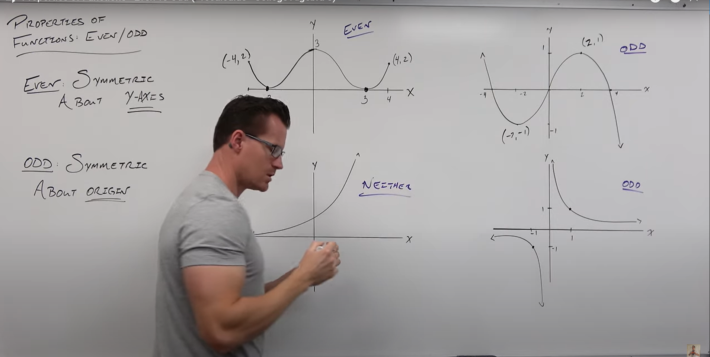
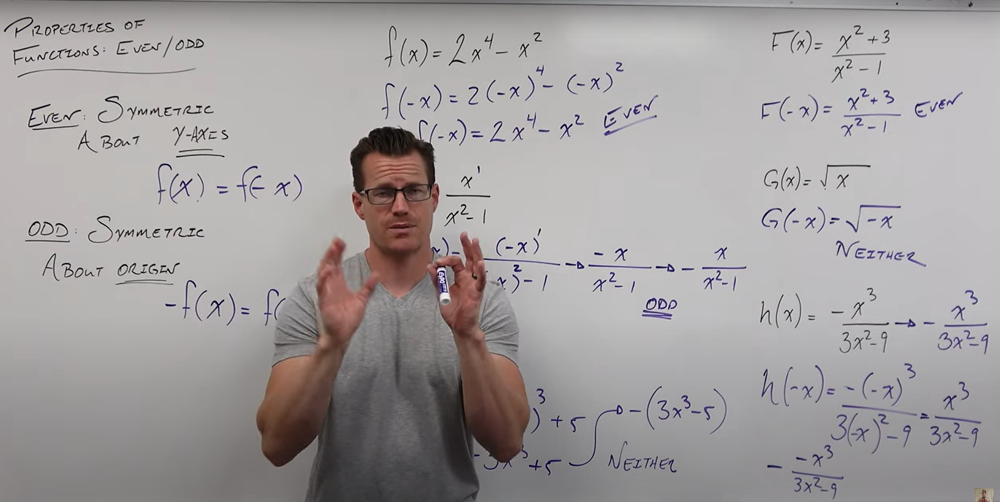
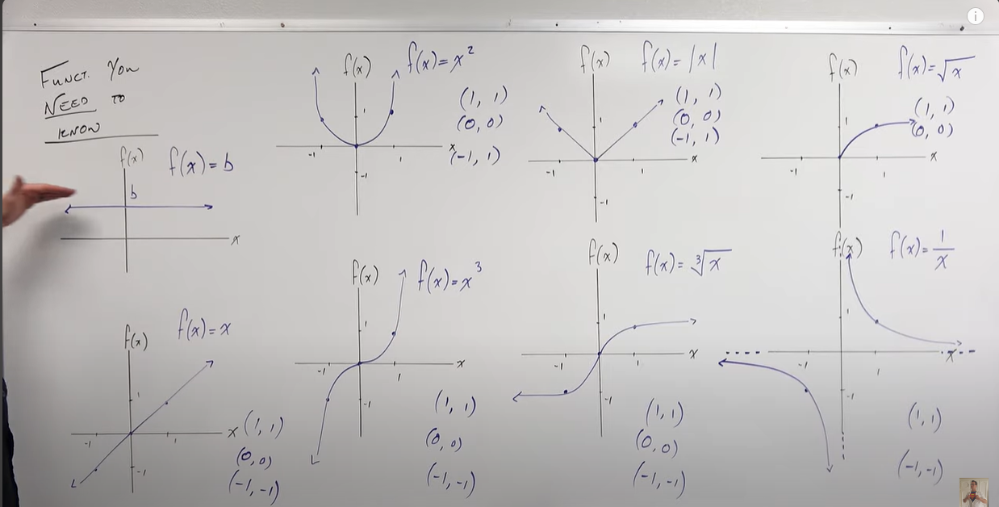

# Functions

Takes one input and maps it mathematically to one output

Input is usually x
Output is usually y or f(x)

An input never gives more than one output

Input is the independent variable 
Output (y or f(x)) is the dependent variable 

(x, y) or (x, f(x)) = ordered pairs for graphing

domain = set of inputs
range = set of outputs

In the domain, every input has to be unique (or else, the input would have multiple outputs, which is not allowed)

To determine if algebraic expressions are functions, arrange them so that you are solving for y.  
if y only produces one output, it is a function

So, for example y = $\pm$ $\sqrt{3 - 2x}$ would not be a function because the $\pm$ creates two possible outputs for y

Every time you need to take a square root to solve an expression for y, you are going to need $\pm$ so every time you need to take a square root, it is not a function

## Composition

Evaluating a function requires replacing the independent variable with something else. 

### Domain problems: 

Input that evaluate to negative numbers inside a square root are a problem

Remember, you can't divide by zero, so input that results in $\dfrac{5}{0}$ or denominator of zero is a problem. Dividing by zero results in undefined. 

### Difference Quotient

$\dfrac{f(x=h)-f(x)}{h}$ results in slope because you are dividing the difference in output values (y values, "rise") and dividing by the change (x value, "run")

## Domain 

Domain is the set of inputs of a function that give a **real** number output (not imaginary and not undefined - divide by zero)

Inside of the square root must be positive 

Denominators can not be zero

So...

f(x) = $\sqrt{5-4x}$ 

5 - 4x needs to be >= 0

When you solve for square roots, the result tells you what it wants the domain to be so, for example

D: x <= $\frac{5}{4}$

(Domain includes any real number that is less than $\frac{5}{4}$ , which can include negative numbers!)

Nomenclature: D: {x | x <= $\frac{5}{4}$ }

"Domain is x SUCH THAT x is less than or equal to five-fourths"

Interval notation: 

( - $\infty$ , $\frac{5}{4}$ ]

When you have fractions, you set the denominator equal to zero to solve for what numbers CAN NOT be the domain

So...

g(t) = $\frac{5t}{2^3 -16t}$

$2^3$ -16t = 0

Solve that: t != 0, t != 4, t != -4 (if you plugged any of these in the function, the denominator would equal zero, so they are not part of the domain!)

Interval notation: 

(- $\infty$, -4) U (-4, 0) U (0, 4) U (4, $\infty$)

if the function has no square roots, no fractions and no logarithms, then the domain is all real numbers

( - $\infty$, $\infty$ )

### Operations of functions

When dividing fucntions, retain the domain from the original functions, divide the functions and then include in the set, the additional domain outputs from the division. 

So...

f(x) = $\frac{2x-3}{3x-2}$ and g(x) = $\frac{4x}{3x-2}$  ... 3x-2=0, d: {x| x!= $\frac{2}{3}$ )

retain that. 

Then perform the division.  Resulting in x!=0.  So, in total: d: {x| x!= $\frac{2}{3}$ , x!=0 }

In short: When you add/subtract/multiply/divide functions, you always retain the problems of the domain of the original function. After executing the operations, you may add new problems to the domain, but you will never lose the original problems.  

### Verical Line Test

Graphing - horizontal axis is input, vertical is output

Plot your input on the horizontal axis, draw a vertical line extending above and below it, if it has more than one output on that line, it is not a function (remember: to be a function, an input can only have one output)

## Evens vs Odds

If you graph an **even** function, it is symmetric on the y-axis.

For even functions, opposite inputs (x), give you the same outputs (y)

f(x) = f(-x)

**Odd** functions: if you rotate the graph 180$\degree$ about the origin, it'll be the same picture

Opposite inputs equal opposite outputs 

-f(x) = f(-x)

### To solve

If you plug in a negative value for a positive function and nothing changes, you have an even function

f(x) = 2x${^4}$ - x${2}$

plug in -x. 

-x to any exponent becomes positive, so nothing changes in this one.  The function is even. 

If you solve it, and it becomes the same thing but opposite sign, it is odd.  

## Essential functions

All odd functions have (1,1) and (-1,-1) as points. 

Must memorize these: 

