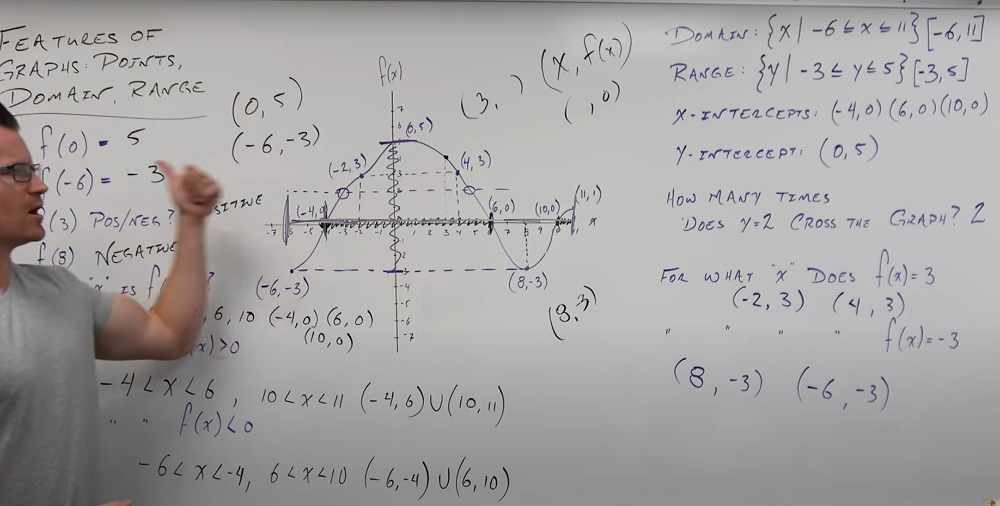
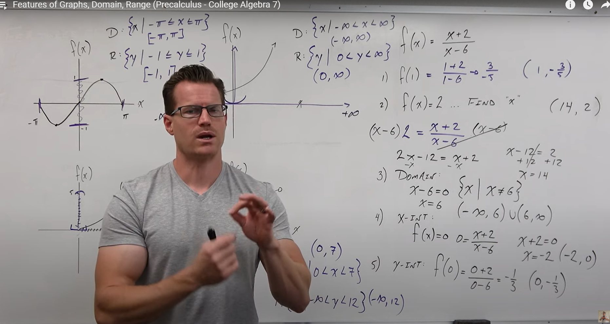
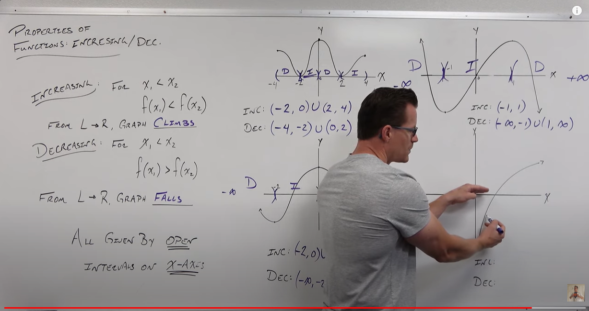
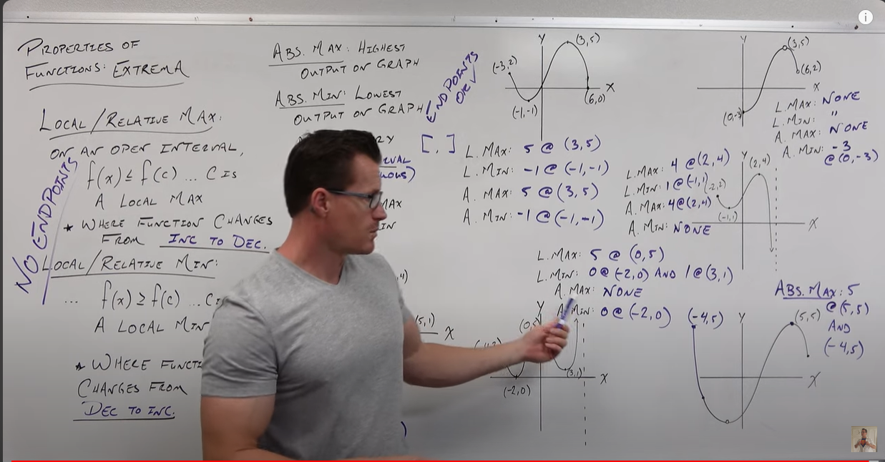
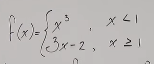
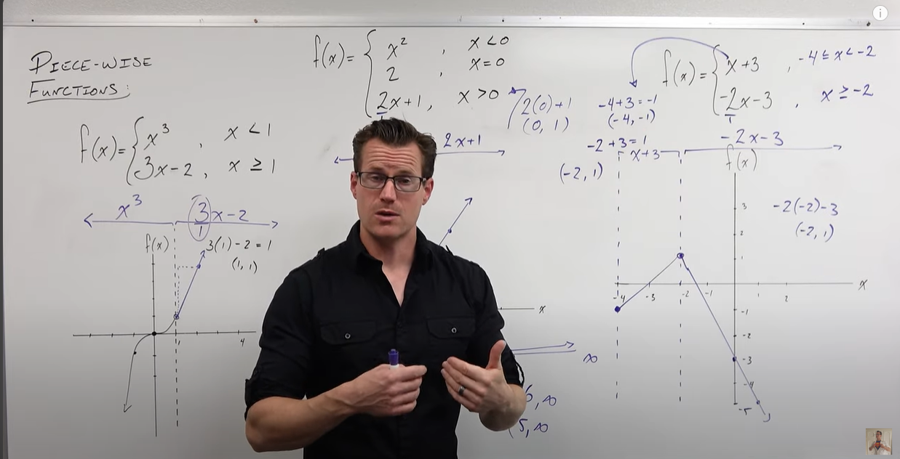
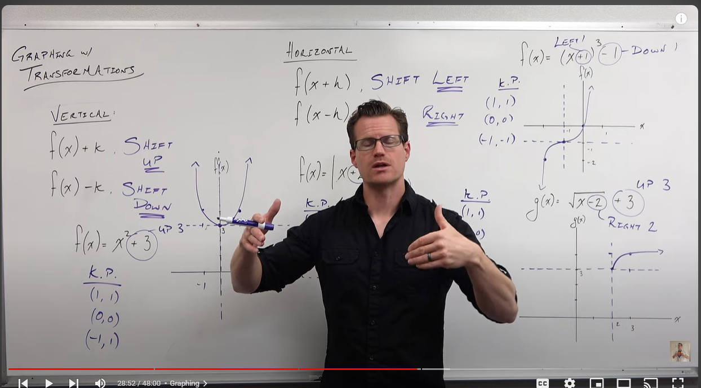
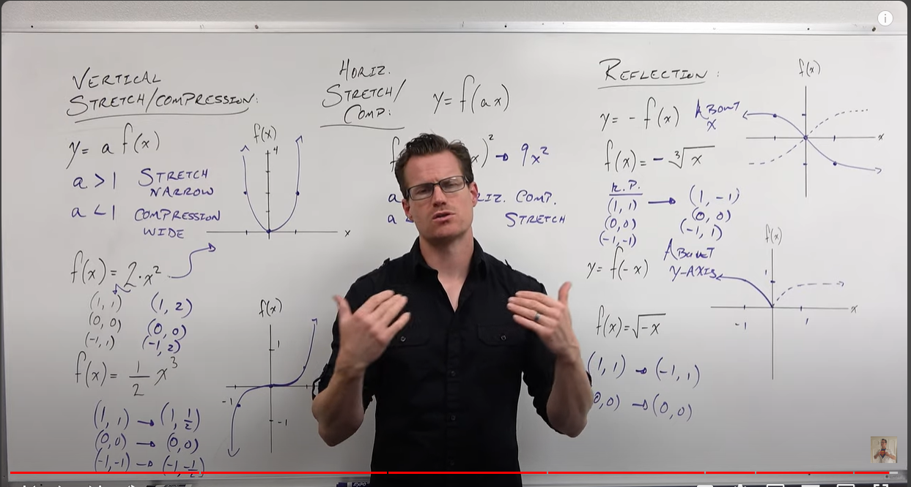

# Graphs

Going to learn about points, domain, and range. 

What does f(0) really mean? What is the output of the function, given your input is 0. So: ( 0, )

So, f(x)=0 is asking, what values can x be that outputs (y axis) of 0? So: ( , 0).    If you have a graph, find all the x-intercepts, where the y-axis is 0.  

f(x) > 0 is asking for what interval, is your x-axis positive? an answer could be something like -4 < x < 6.  In interval notation, that's (-4, 6). Parantheses instead of brackets because you starting from near 4, not AT 4 and going to near 6, not TO 6.  (Because the question asked f(x) > 0, not f(x) >= 0)

**Domain** is the entire section of the x-axis that our graph covers. Could be something like {x | -6 <= x <= 11}. Notice that we are using brackets and equals, because we want to include -6 and 11. [ -6, 11 ]

**Range** is the section of the y-axis covered by the graph. So, something like {y | -3 <= y <= 6}. [-3, 6]

**x-intercepts** are the points on the graph that intercept the x axis with a y=0. 

**y-intecept** is the one point where the y-axis crosses x=0. (if it exists) 

### Solving without Graphs

f(x) = $\frac{x+2}{x-6}$ 

f(x) = 2?

2 = $\frac{x+2}{x-6}$ 

Solve 

x = 14.  so (14, 2)

**How to find x intercept.**  Remember x intercept means x = 0. f(x) = 0 

0 = $\frac{x+2}{x-6}$

Solve. Really easy because the denominator x 0 = 0.  So, it becomes 0 = x + 2.  x = -2.  (-2, 0)

**How to find y intercept.** Remember, y intercept means that x = 0.  So f(0) = $\frac{x+2}{x-6}$ 

Solve

f(0) = $\frac{0+2}{0-6}$ 

(0, - $\frac{1}{3}$ )

## Increasing or Decreasing

Increasing and decreasing is simply the x-axis intervals where the graph is either climbing (increasing) or falling (decreasing).

Indicate those intervals with parentheses (open intervals) because the points at which the graph is level, it is neither decreasing nor increasing. 

## Extrema (local and absolute max/min)

Only going to learn these now with graphs because we would need calculus to determine algebraically. 

The local max is the peak (output) between increasing and decreasing. But cannot occur at an endpoint. You can have multiple local maxes. 

The local min is the trough (output) between decreasing and increasing. But cannot occur at an endpoint. You can have multiple local mins. 

The absolute max is the highest output on a graph and can be an endpoint. 

The absolute min is the lowest output on a graph and can be an endpoint.  

If you don't have a continuous graph, you might not have a local/absolute min/max (in the top-right graph in the image, for example, where the local max would be is an open point).  In that example, for the same reason, there is no absolute max.  There is an absolute min, though, because the lowest point is a closed point.  

## Average Rate of Change

In this image, the secant line is the top one, and the tangent is the bottom one. 

The average rate of change for the secant line is not initially a good representation for the average rate of change for the tangent line. 

But, as you bring b on the x-axis closer to a, the rate of change for the secant line becomes a closer representation for the rate of change for that point b of the tangent line.  

The **average rate of change** is the slope between two points. 

Average rate of change =  $\frac{f(b) - f(a)}{x_2 - x_1}$

## Graphing piecewise functions 

In a piecewise function, you are told which of the inputs (pieces) to use, based on some conditions. 

Above, you would use $x^3$ as input if  x < 1.  You would use 3x-2 if x >= 1.

$x^3$ and x <= 1 is the domain of this function. 

To graph these, you first divide up your graph based on the intervals of the domain.  You then graph the lines for each input, but only within its interval on the x-axis.  

## Graph Transformations

If you add or substract from a function's output value, you will transform the graph vertically.  (think about it: in the functions below, the constant changes the output, not the input; the input is still x): 

f(x) + k
f(x) - k

Same logic with the horizontal shift: You shift horizontally when the constant that you add (or substract) to the function is affects the input. **But**, the shift is opposite of the direction you would intuitively think (plus shifts left, subtract shifts right): 

f(x+h)
f(x-h)

Functions can shift vertically *and* horizontally: 

f(x) = (x+1)$^3$ -1 

The plus 1 in the parantheses affects the input, the minus one out affects the output.

### Stretching, compressing, reflecting

When you multiply your output value , you vertically stetch/compress:

y = a * f(x)

If the number you are multiplying the output by is greater than one, then you stretch vertically.  If it is less than one, you compress.

A vertical stretch is a horizontal compression. Stretch makes the graph more narrow. 
A vertical compression is a horizontal stretch. Compression makes the graph more wide. 

Since it affects the output, you can multiply the constant with the outputs of your key points (key points are the points that you know from our library of essential functions)

Horizontally compress/stretch, when you multiply the input.  
Remember, when affecting inside the parantheses (the input), the shift is opposite of your intuition. 
Mutliply input by number greater than one, you horizontally **compress**
Multiply input by number less than one, you horizontally **stretch**

Reflect about the x-axis when you change the sign of the output: 

y = -f(x)

That literally says, y (the output) is negative.  So, where the outputs in the key points would normally be positive, they become negative. And vice versa. Just change the sign of the outputs in your key points. 

Reflect about the y-axis when you change the sign of the input: 

y = f(-x)

