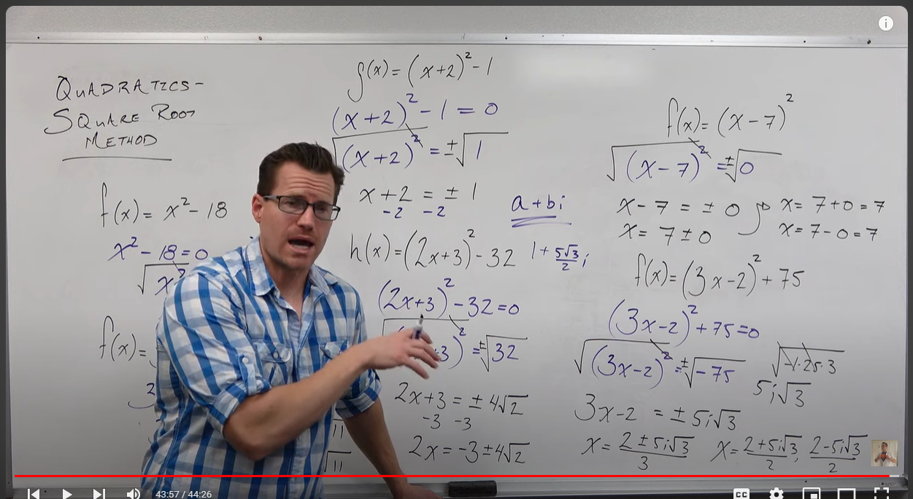
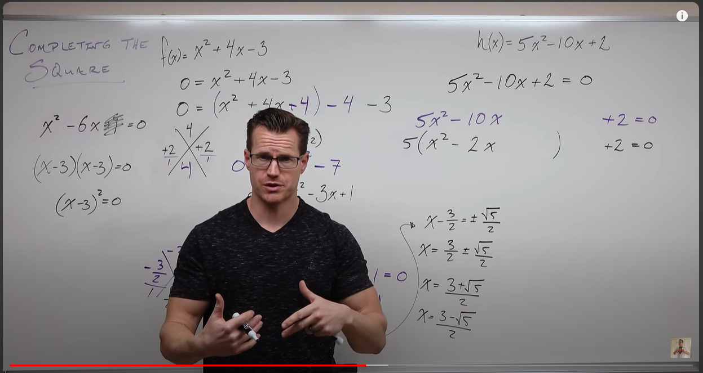
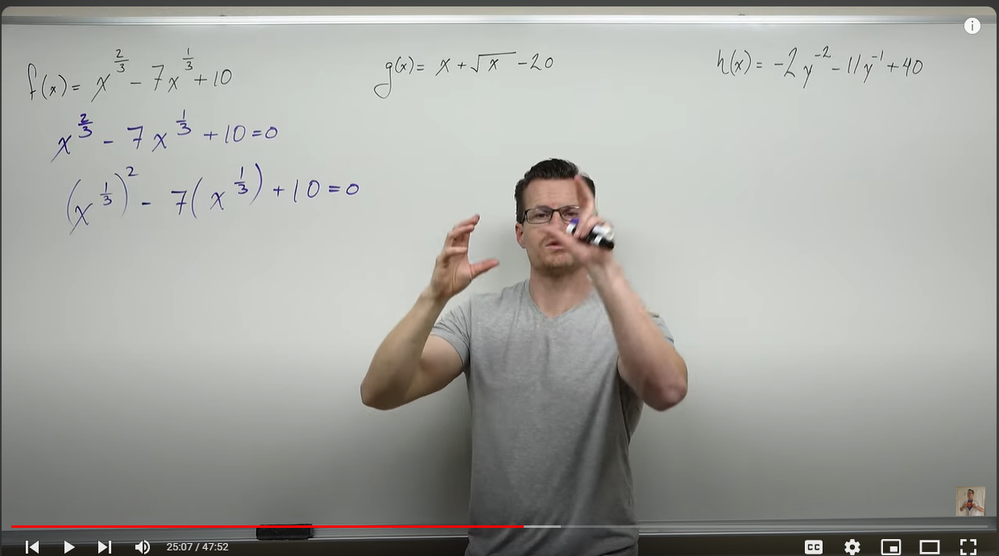
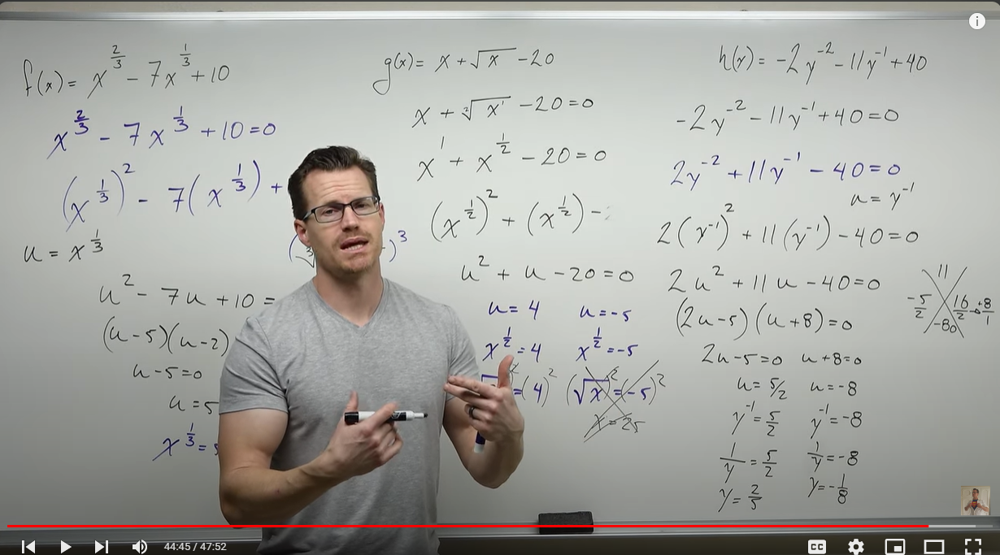

## Square Root Method

1. Set quadratic = 0
2. Isolate the x $^2$
3. Take the square root of both sides
*Don't forget to add +/- with your square root (because, remember, you're looking for the x-intercepts of a parabola, so you typically will get two solutions)*

Square root method only works if you can isolate all the x's with a $^2$ 

ON your graph, if you get two different solutions with real numbers, the parabola will go through x and have two x-intercepts.
If you get two solutions that are the same real numbers, the parabola will touch at the x-intercept, but not go through the x axis
If you get two solutions that have imaginary numbers, your parabola will not go through x axis. 

You get imaginary numbers when you try to get the square root of a negative number

**Note:** *The solution in the bottom right function has an error, the two in the denominator should be three*

## Factoring

1. set quadratic = 0
2. make sure the term are in order
3. make sure first term is positive
4. Distribute
5. Factor out the GCF, if there is one
6. Factor by grouping.
   1. Find two terms that add up to the second term and multiple to the first term times the third term
   2. Rewrite the quadratic with the second term split into the two terms identified in the previous step
   3. Factor out the two groups in the new quadratic 

 If you can factor, you will always get x-intercepts (no imaginary numbers)

## Completing the Square

Imagine you have: x $^2$ -6x = 0 or an equation that won't factor easily. 

You want to factor but you don't have a third term or you do, but it won't factor.  

**Find two same numbers that add to the second term, multiply them and add the out come as the third term to the equation**

But, remember, if you are adding a term to the equation, you must cancel it out somehow. 

If you have an equation that has three terms but won't factor, temporarily disregard the third term and use the first two terms to do the step bolded above. 

When you add the new third term into the equation, after you factor the squares, you need to subtract the added term. 

so: 

0 = x $^2$ + 4x - 3

0 = x $^2$ + 4x +4 -4 -3 

(x+2)(x+2) - 7 = 0

(x+2) $^2$ -7 = 0 

(x+2) $^2$  = 7 

$\sqrt{(x+2)^2}$ = +- $\sqrt{7}$

x = -2 + $\sqrt{7}$ and x = -2 - $\sqrt{7}$

**Note:** *This works if the coeficient on the a term is 1.*

If you can factor out from the first two terms to make the coefficient in the first term 1.  See the example in the top right: 

In the example above, though you added 1 to the equation, you actually have to cancel it by minusing 5 (because you have to distribute the 5 that is outside of the parentheses). So: 

5(x $^2$ - 2x +1) - 5 + 2 = 0

**Note:** *How to divide a fraction in half?  Divide the numerator by two or nultiply the denominator by two*

## Quadratic Formula

x = $\frac{- (b) +- \sqrt{(b) ^2 -4(a)(c)}}{2(a)}$

quadratic has three terms (a, b, c) that you will plug into the formula

$3x ^2 - 5x +1 = 0$

a is 3

b is -5

c is 1

**Note:** *In the previous video, he proved the formula using completing the squares.*

The term inside the squart root is called the **discriminant**

**Don't ever plug fractions into the quadratic formula**

To get rid of the fraction, multiply both sides by the Least Common Denominator 

If your a term is negative, you can change it to positive, but you must change the sign for all terms. 

To use the quadratic formula, first need to get the quadratic in standard form:

$ax ^2 + bx + c$

When you simplify, you have to remember how to simplify a square root.  Like 48: 

Take the largest perfect square that goes into the number (48) which, in this case, is 16.  16 * 3 = 48.  square root of 48 becomes $\sqrt{16 * 3}$

The square root of 16 is 4, and you can't take a square root of 3, so you get: $4 \sqrt{3}$

If you have the square root of a negative number, you are going to have an imaginary number, so...

For example: $\sqrt{-63}$

Simplify into -1 and 9 * 7 

$\sqrt{-1 * 9 * 7}$

which simplifies to 3i $\sqrt{7}$ (remember the square root of -1 is i)

## Solving with Substitutions 

Works if the first term is to the second power and the second term is to the first power and both of the terms being raised are the same 

(they have to be the same so that you can replace them with the same variable)

1. Set the function = 0
   1. Substitution will work if the exponent of the first term is 2x the exponent in the second term
   2. To set up the quadratic for substitution, you can replace the exponent of the first term with the exponent from the second term, and then square the exponent of the first term (see example below)
2. Replace the common term in the first and second term with u
3. Now you should have $u^2$ * u + c = 0.  Which you can factor out. 
4. Solve for u
5. Whatever you got for u (may be two values), set equal to the orignal value your replaced.  So, in the example below: $x^\frac1{3}$ = 5. 
6. Solve for x (or whatever variable you substituted for). In the example above, you could cube both sides to remove the $\frac1{3}$ exponent. 

$x^\frac2{3}$ becomes $x^\frac1{3}$ $^2$  

Which prepares us to perform substitution for the $x^\frac1{3}$ term. 

u = $x^\frac1{3}$

